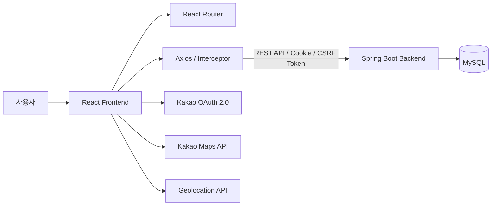
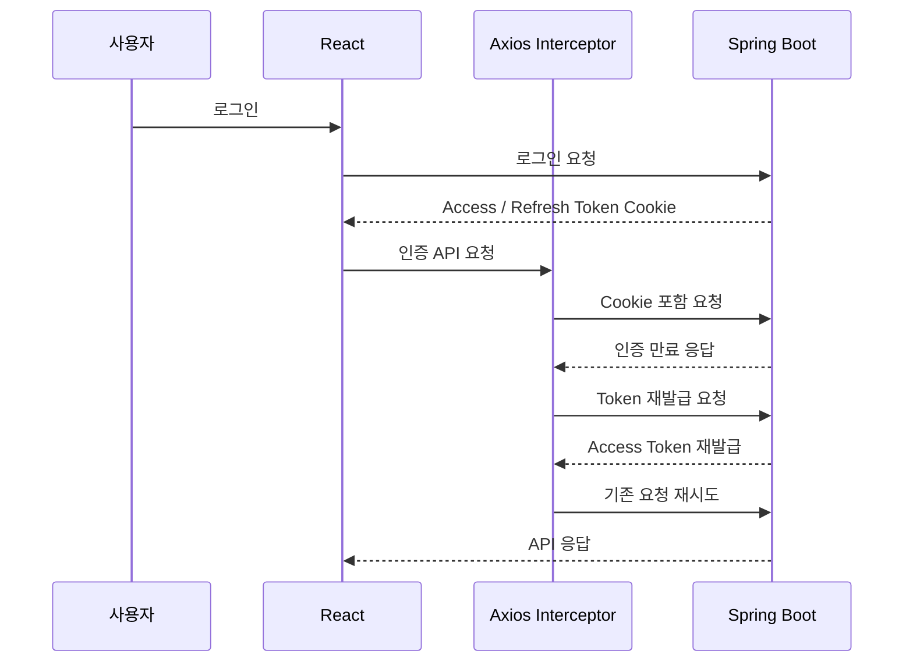

# 🐶 Petmily Frontend

> 반려동물 보호자와 펫시터를 연결하는 돌봄 구인·구직 서비스의 프론트엔드 프로젝트


## 📌 프로젝트 소개

Petmily는 반려동물 보호자가 돌봄을 요청하고, 펫시터가 구인·구직 게시글을 통해 돌봄 정보를 확인할 수 있는 웹 서비스입니다.

React 기반 SPA로 회원·반려동물·게시글·댓글 UI를 구현하고 Spring Boot REST API와 연동했습니다. Axios Interceptor를 이용해 HttpOnly Cookie 기반 인증과 CSRF Token 처리를 공통화했으며, Kakao OAuth 2.0 로그인과 Kakao Maps API를 활용한 위치 기반 게시글 조회 기능을 구현했습니다.

* 개발 형태: 개인 프로젝트
* 개발 기간: 2025.09 ~ 진행 중
* Backend Repository: [Petmily_BE](https://github.com/woohyun1007/Petmily_BE)
* Notion : [Petmily_FE 상세 문서](https://app.notion.com/p/Petmily-39fb883853bf806eae1de6f2e3e11cf6?source=copy_link)

## 🛠 기술 스택

| 구분             | 기술                                           |
| -------------- | -------------------------------------------- |
| Language       | JavaScript                                   |
| Frontend       | React, React Router                          |
| Styling        | Styled Components                            |
| HTTP Client    | Axios                                        |
| Authentication | HttpOnly Cookie, CSRF Token, Kakao OAuth 2.0 |
| Map / Location | Kakao Maps API, Geolocation API              |
| Build          | Vite                                         |
| Collaboration  | Git, GitHub                                  |

## 🏗 시스템 아키텍처



## 📂 프로젝트 구조

```text
src
├── component
│   ├── common     # 위치 인증 등 공통 UI
│   ├── pets       # 반려동물 등록·조회·수정·삭제
│   ├── posts      # 게시글, 댓글, 검색·필터링, 지도 조회
│   └── users      # 회원가입, 로그인, 회원정보, Kakao OAuth
├── context
│   └── AuthContext.jsx       # 전역 사용자 인증 상태 관리
├── hooks
│   └── useNavigationGuard.jsx # 작성 중 페이지 이탈 방지
├── styles                     # 공통 스타일, 테마
├── utils                      # 인증 관련 유틸리티
├── api.js                     # Axios 설정 및 Interceptor
├── App.jsx                    # Routing 및 전체 애플리케이션 구성
└── main.jsx                   # React Entry Point
```

## 🔐 인증 흐름



## ✨ 주요 기능

| 도메인    | 구현 기능                                                      |
| ------ | ---------------------------------------------------------- |
| 인증     | 일반 로그인, 로그아웃, 로그인 상태 확인, 인증 만료 시 Access Token 재발급 및 요청 재시도 |
| 소셜 로그인 | Kakao OAuth 2.0 로그인 및 Callback 처리                          |
| 보안     | HttpOnly Cookie 기반 인증 요청, CSRF Token 조회·캐싱·요청 Header 처리    |
| 회원     | 회원가입, 이메일 인증, 내 정보 조회·수정, 비밀번호 변경, 회원 탈퇴                   |
| 반려동물   | 이미지가 포함된 반려동물 등록, 내 반려동물 목록 조회, 수정·삭제                      |
| 게시글    | 게시글 작성·상세 조회·수정·삭제, 검색, 정렬, 상태·카테고리 필터, 페이징                |
| 위치     | Geolocation API를 이용한 현재 위치 확인 및 Kakao Maps 기반 지역 정보 처리     |
| 지도     | 돌봄 게시글의 위치 정보를 기반으로 Kakao Map Marker 표시 및 게시글 이동           |
| 댓글     | 게시글별 댓글 작성·조회, 작성자에 따른 수정·삭제 UI 처리                         |
| 공통 처리  | API 오류 메시지 처리, 인증 상태 관리, 작성 중 페이지 이탈 방지                    |

## 🚀 실행 방법

### 1. 요구사항

* Node.js
* npm

### 2. 저장소 복제

```bash
git clone https://github.com/woohyun1007/Petmily_FE.git
cd Petmily_FE
```

### 3. 환경 변수 설정

프로젝트 루트에 `.env` 파일을 만들고 필요한 환경 변수를 설정합니다.

```dotenv
VITE_API_BASE_URL=http://localhost:8080

VITE_KAKAO_REST_API_KEY=your_kakao_rest_api_key
VITE_KAKAO_REDIRECT_URI=your_kakao_redirect_uri
VITE_KAKAO_MAP_API_KEY=your_kakao_map_api_key
```

> Kakao API Key와 Redirect URI는 Kakao Developers에 등록된 애플리케이션 설정과 일치해야 합니다.

### 4. 의존성 설치

```bash
npm install
```

### 5. 애플리케이션 실행

```bash
npm run dev
```

Production Build는 다음 명령을 사용합니다.

```bash
npm run build
```

## 📌 Future Improvements

* UI/UX 및 반응형 디자인 개선
* 전역 상태 관리 구조 개선
* 공통 컴포넌트 및 API 로직 리팩터링
* Docker 기반 컨테이너 배포
* WebSocket 기반 실시간 채팅 UI
